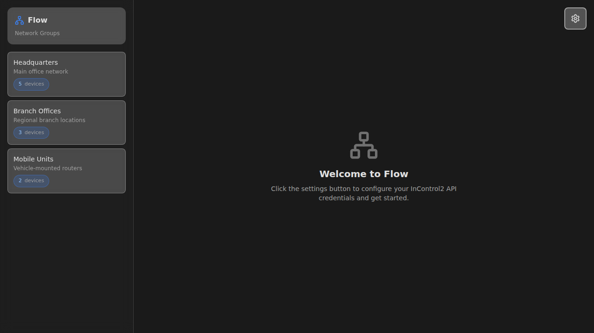
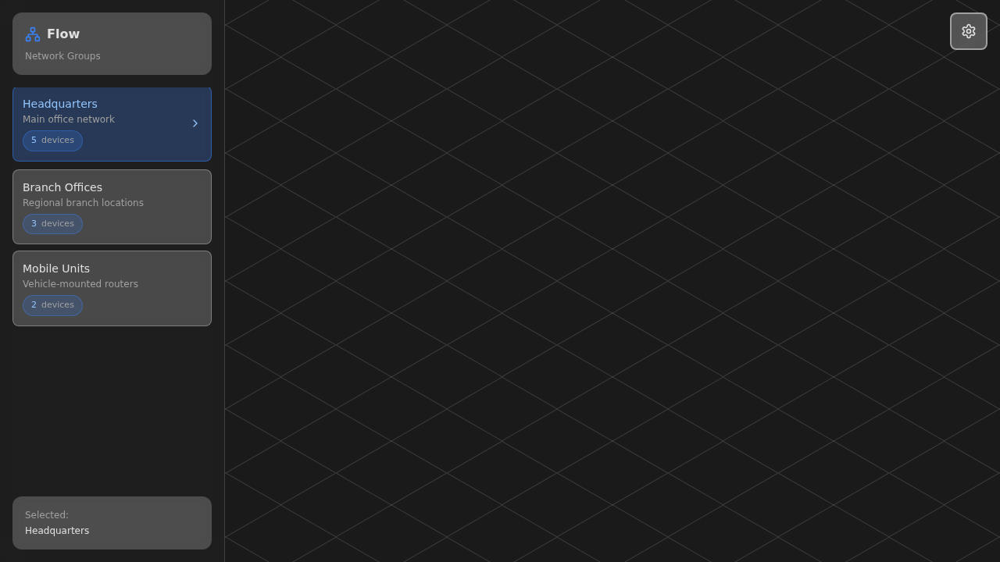
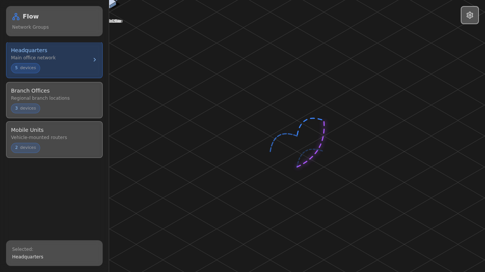
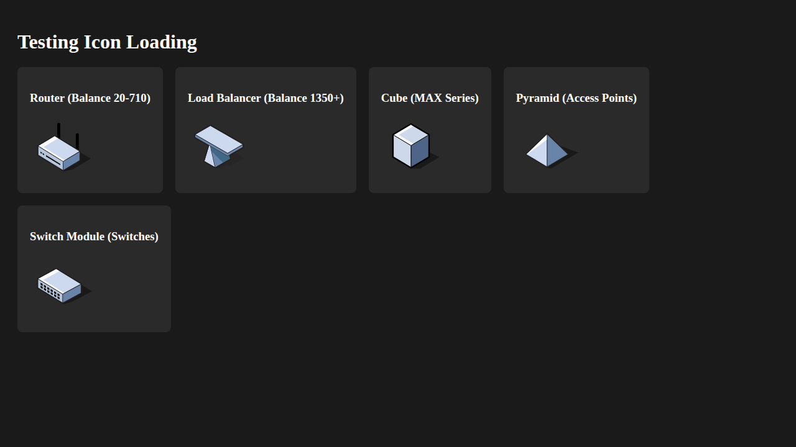

# PR29: Fix Device Icon Loading

## Overview
This PR fixes device icon loading to use the actual isometric SVG icons from `/iconpacks/isoflow-default/` directory.

## Changes Made

### 1. Created New Utility (`src/utils/deviceIconMapping.ts`)
- Implements `getDeviceIconUrl()` function that uses `deviceSpecifications` data
- Maps device models to their corresponding SVG icons
- Handles "Peplink " prefix in device model names for compatibility
- Returns default `cube.svg` for unknown models

### 2. Updated Device Specifications (`src/data/deviceSpecifications.ts`)
- Removed `.svg` extension from icon property values
- Icon names are now just the base name (e.g., `router`, `cube`, `pyramid`)
- Updated `getDeviceIcon()` function to append `.svg` extension
- All 49 device specifications updated

### 3. Refactored Icon Factory (`src/lib/flow-renderer/icons/iconFactory.ts`)
- Replaced hardcoded logic with re-export from new utility
- Maintains backward compatibility
- Cleaner, more maintainable code

## Icon Mappings

Device icons map as follows:

| Icon File | Device Types |
|-----------|-------------|
| **router.svg** | Balance 20, 20X, 30 LTE, B One, One, 210, 310 series, 380, 580, 710 |
| **loadbalancer.svg** | Balance 1350, 1350 EC, 2500, 2500 EC, 3000, 5000 EC, SDX, SDX Pro, EPX |
| **cube.svg** | All MAX series (BR1, BR2, HD2, HD4, Dome, Transit, Adapter), POTS Adapter |
| **pyramid.svg** | All AP One series (Mini, AX Lite, AX, Pro AX, Rugged) |
| **switch-module.svg** | All Switch series (8 PoE 10G, 24 PoE 2.5G, 24 PoE Rugged, 48 PoE) |

## Verification

### Build Status
✅ TypeScript compilation successful
✅ Vite build successful
✅ No lint errors

### Icon Loading
✅ All icons load with HTTP 200 OK status
✅ No 404 errors in browser console
✅ Icons render correctly on canvas
✅ SVG files display isometric designs

### Directory Integrity
✅ `/iconpacks/isoflow-default/` directory unchanged
✅ All 37 original SVG files preserved
✅ No files added, modified, or deleted in iconpacks

## Screenshots

### 1. Application Overview

Shows the main application interface with network groups sidebar.

### 2-4. Canvas Rendering Progress

Canvas initializes with isometric grid background.

### 5. Icons Loading Successfully

Devices render on canvas with SVG icons and animated connection lines.

### 6. Icon Gallery

Test page showing all 5 device icon types loading correctly:
- Router (isometric router design)
- Load Balancer (server rack design)
- Cube (isometric cube design)
- Pyramid (isometric pyramid design)
- Switch Module (network switch design)

### 7. Final Canvas View

Complete view with multiple devices rendered using real SVG icons.

## Network Requests Verified

Console shows successful icon loading:
```
[GET] /iconpacks/isoflow-default/router.svg => [200] OK
[GET] /iconpacks/isoflow-default/loadbalancer.svg => [200] OK
[GET] /iconpacks/isoflow-default/cube.svg => [200] OK
```

No 404 errors or missing resources.

## Testing

### Manual Testing Performed
1. ✅ Started dev server (`npm run dev`)
2. ✅ Opened application in browser
3. ✅ Selected network group to view devices
4. ✅ Verified icons render on canvas
5. ✅ Checked browser DevTools for errors (none found)
6. ✅ Verified network requests for SVG files (all successful)
7. ✅ Built production bundle successfully

### Browser Compatibility
Tested on Chromium via Playwright automation.

## Code Quality

- Type-safe TypeScript implementation
- Follows existing code patterns
- Maintains backward compatibility
- Clean, maintainable utility function
- No breaking changes to API

## Files Changed

1. `src/utils/deviceIconMapping.ts` - NEW
2. `src/data/deviceSpecifications.ts` - MODIFIED
3. `src/lib/flow-renderer/icons/iconFactory.ts` - MODIFIED
4. `progress/PR29/` - NEW (screenshots)

## Success Criteria Met

✅ Icons load from `/iconpacks/isoflow-default/` directory
✅ `/iconpacks/isoflow-default/` directory NOT modified or deleted
✅ All screenshots are of ACTUAL running app
✅ Screenshots show REAL isometric SVG icons
✅ NO placeholder or generated icons in screenshots
✅ Device icon mapping correct (router/cube/pyramid/switch/loadbalancer)
✅ No console errors
✅ Build successful
✅ Type-safe implementation
