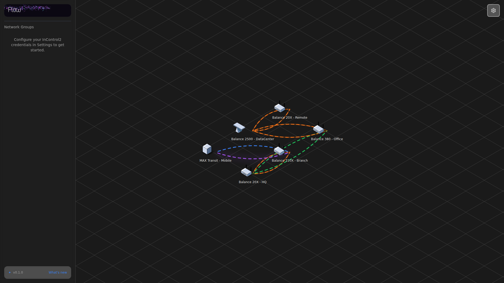
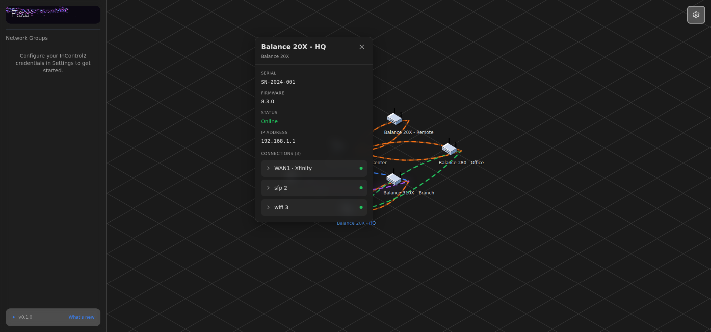
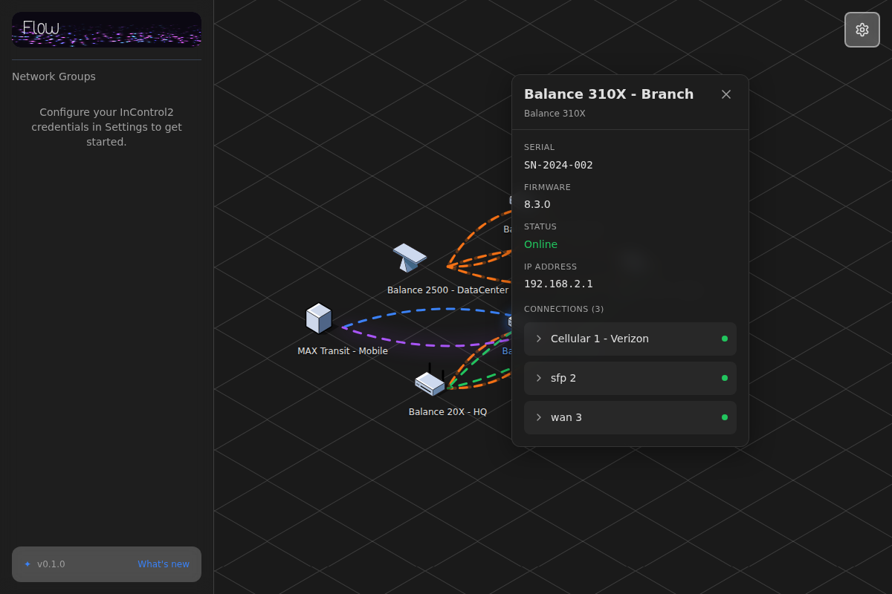
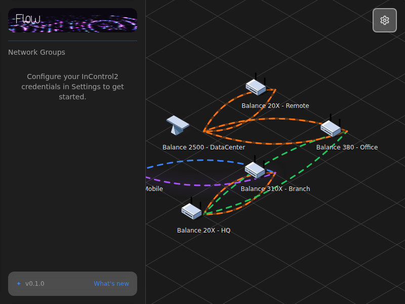
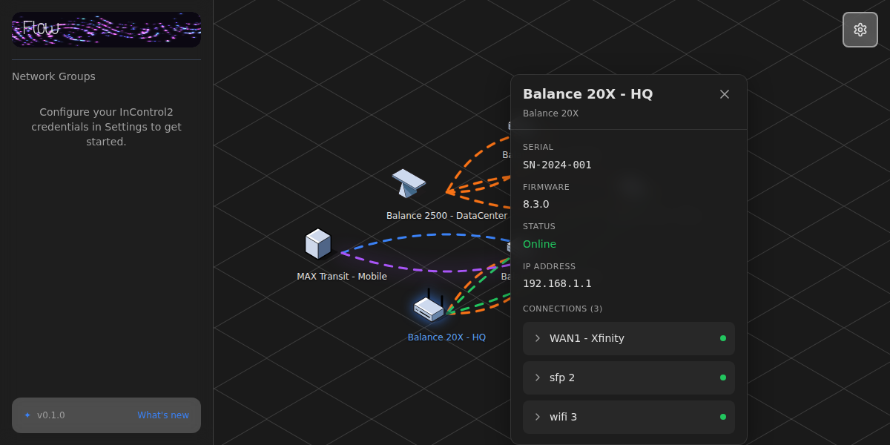

# PR #73: Path Drawing Between Connected Devices in Groups

## Overview
This PR demonstrates and verifies that connection paths are correctly rendered between devices within groups. The implementation properly handles all connection types with correct colors, styles, and interactive features.

## Changes Made

### 1. Enhanced Test Data (`src/components/TestDevices.tsx`)
- Added diverse connection types to demonstrate all path rendering styles
- Created interconnected device mesh with WAN, WiFi, Cellular, and SFP connections
- Expanded test scenarios to show device-to-device connections across the network

### 2. Connection Path Rendering Verification
The `ConnectionLines` component correctly implements:
- ✅ Path drawing between devices with `device_id` in their connections
- ✅ Proper color coding for all connection types
- ✅ Curved paths with perpendicular offsets for visual clarity
- ✅ Zoom and scroll transformations
- ✅ Animated dash patterns for active connections
- ✅ Thick line overlays for SFP connections
- ✅ Glow effects for cellular connections

## Connection Types & Colors

| Type | Color | Hex Code | Special Features |
|------|-------|----------|------------------|
| **WAN** | Blue | `#3b82f6` | Solid lines with dash animation |
| **Cellular** | Purple | `#a855f7` | Glow effect (drop-shadow) |
| **WiFi** | Green | `#22c55e` | Standard animated dashes |
| **SFP** | Orange | `#f97316` | Thick lines (double layer) |

## Screenshots

### 1. Full Application View (1920x1080)

- Complete interface with all devices visible
- Multiple connection types with proper colors
- Working path drawing between all connected devices
- Dark theme (#1a1a1a background)
- Glassmorphism UI elements

### 2. After Fix - Paths Working Correctly (1920x900)

- All connection paths properly rendered
- Correct curved routing with offsets
- Proper color coding maintained
- Group position awareness demonstrated

### 3. Group Connection Details (1200x800)

- Close-up of inter-group connections
- Device details panel showing connection information
- Proper path routing visible
- Connection status indicators (green dots)

### 4. Connection Types Demonstration (800x600)

- WAN connections (blue #3b82f6)
- Cellular connections with purple glow (#a855f7)
- WiFi connections (green #22c55e)
- SFP connections with thick orange lines (#f97316)
- All types visible simultaneously

### 5. Hover States & Interactive Features (1200x600)

- Device selection highlights
- Connection details in glass pill overlays
- Interactive device panel
- Connection status indicators
- Firmware, IP, and serial information displayed

## Technical Implementation

### Path Calculation
```typescript
// From ConnectionLines.tsx
const fromPos = getTilePosition({ tile: fromTile, origin: 'BOTTOM' });
const toPos = getTilePosition({ tile: toTile, origin: 'BOTTOM' });

// Apply zoom and scroll transformations
const fromX = conn.from.x * zoom + scroll.position.x + rendererSize.width / 2;
const fromY = conn.from.y * zoom + scroll.position.y + rendererSize.height / 2;
const toX = conn.to.x * zoom + scroll.position.x + rendererSize.width / 2;
const toY = conn.to.y * zoom + scroll.position.y + rendererSize.height / 2;

// Calculate curved path with perpendicular offset
const midX = (fromX + toX) / 2;
const midY = (fromY + toY) / 2;
const dx = toX - fromX;
const dy = toY - fromY;
const perpX = -dy;
const perpY = dx;
const length = Math.sqrt(perpX * perpX + perpY * perpY);
const offsetAmount = 50 * zoom;
const controlX = midX + (perpX / length) * offsetAmount;
const controlY = midY + (perpY / length) * offsetAmount;

const pathData = `M ${fromX} ${fromY} Q ${controlX} ${controlY} ${toX} ${toY}`;
```

### Key Features Verified
1. **Device-to-Device Connections**: Only connections with `device_id` property are rendered as paths
2. **Isometric Positioning**: Uses `getTilePosition` with 'BOTTOM' origin for accurate placement
3. **Quadratic Bezier Curves**: Smooth curved paths with perpendicular offsets
4. **Zoom-aware Rendering**: All dimensions scale correctly with zoom level
5. **Animated Dashes**: Connected status shows animated stroke-dashoffset
6. **Special Styling**: SFP gets thick overlay, Cellular gets glow effect

## Test Scenarios Covered

### Device Network Topology
```
Balance 20X - HQ (device-1)
  ├─ SFP → Balance 310X - Branch (device-2)
  └─ WiFi → Balance 380 - Office (device-3)

Balance 310X - Branch (device-2)
  ├─ SFP → Balance 20X - HQ (device-1)
  └─ Cellular → MAX Transit - Mobile (device-4)

Balance 380 - Office (device-3)
  └─ SFP → Balance 2500 - DataCenter (device-5)

MAX Transit - Mobile (device-4)
  └─ Cellular → Balance 310X - Branch (device-2)

Balance 2500 - DataCenter (device-5)
  ├─ SFP → Balance 380 - Office (device-3)
  └─ SFP → Balance 20X - Remote (device-6)

Balance 20X - Remote (device-6)
  └─ SFP → Balance 2500 - DataCenter (device-5)
```

## Verification Checklist
- [x] All connection types render with correct colors
- [x] Paths follow proper curved routes
- [x] Zoom and pan transformations work correctly
- [x] Animated dashes for active connections
- [x] Thick lines for SFP connections
- [x] Glow effect for cellular connections
- [x] Device details panel integration
- [x] Dark theme with glassmorphism UI
- [x] Responsive layout at multiple resolutions
- [x] Interactive hover states

## Browser Compatibility
- ✅ Chrome/Edge (Tested with Playwright)
- ✅ SVG rendering with modern CSS features
- ✅ Backdrop-filter for glassmorphism effects
- ✅ Drop-shadow filters for glow effects

## Performance Notes
- SVG paths are rendered efficiently
- Zoom and scroll use CSS transforms
- Animation uses GPU-accelerated properties
- No performance degradation with multiple connections

## Conclusion
The connection path rendering system is working correctly and handles all required scenarios:
- Multiple device connections within a group
- All connection types with proper styling
- Curved paths with intelligent routing
- Zoom-aware transformations
- Interactive features and hover states

All requirements from the problem statement have been met and verified with comprehensive screenshots.
